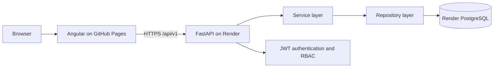

# Factory Monitor Dashboard

A production-oriented factory operations demo for monitoring equipment health, reviewing operating
metrics, and managing machine alerts. Angular 20 provides the responsive operations console;
FastAPI and PostgreSQL provide the authenticated API and persistence layer.

## Architecture



The Angular application uses standalone components, lazy-loaded feature routes, signals, guards,
an HTTP interceptor, and Angular Material. The backend separates API routes, services,
repositories, schemas, and SQLAlchemy models. Services own business rules and transactions;
repositories own database queries.

## Technologies

| Area     | Technology                                                           |
| -------- | -------------------------------------------------------------------- |
| Frontend | Angular 20, TypeScript strict mode, Angular Material, RxJS, SCSS     |
| Backend  | Python 3.12+, FastAPI, SQLAlchemy 2 async, Pydantic 2                |
| Database | PostgreSQL 17, Alembic                                               |
| Security | JWT bearer tokens, Argon2 password hashing, role-based authorization |
| Quality  | ESLint, Prettier, Ruff, Black, Pytest, Jasmine/Karma                 |
| Delivery | Docker Compose, Nginx, GitHub Actions, GitHub Pages, Render          |

## Local Development

### Docker Compose

Requirements: Docker Engine with Docker Compose.

```bash
cp .env.example .env
# Replace POSTGRES_PASSWORD and JWT_SECRET_KEY in .env.
docker compose up --build --wait
```

Open the application at [http://localhost:8080](http://localhost:8080). API documentation is at
[http://localhost:8000/docs](http://localhost:8000/docs), and the health check is at
[http://localhost:8000/health](http://localhost:8000/health).

The backend waits for PostgreSQL, applies Alembic migrations, and runs the idempotent seed process.
The frontend Docker build deliberately uses `environment.docker.ts`, so `/api/v1` continues to be
proxied through Nginx. Production Pages settings do not affect local Docker Compose.

```bash
docker compose down
# To also delete local database data:
docker compose down --volumes
```

### Backend without Docker

Start PostgreSQL with `docker compose up -d database`, then:

```bash
cd backend
python -m venv .venv
# Linux/macOS: source .venv/bin/activate
# Windows PowerShell: .venv\Scripts\Activate.ps1
python -m pip install -e ".[dev]"
cp ../.env.example .env
alembic upgrade head
python -m app.seed
uvicorn app.main:app --reload
```

The root example URL assumes the example PostgreSQL password. Keep `POSTGRES_PASSWORD` and the
password in `DATABASE_URL` aligned when running processes directly on the host.

### Frontend without Docker

Angular requires Node.js 20.19 or newer.

```bash
cd frontend
npm ci
npm start
```

The development server runs at `http://localhost:4200` and proxies `/api` to FastAPI at
`http://localhost:8000`.

## Seed Accounts

These accounts are public demo data. Replace or remove them before using the application for real
users.

| Role          | Email                        | Password       |
| ------------- | ---------------------------- | -------------- |
| Administrator | `admin@factorymonitor.io`    | `Admin123!`    |
| Operator      | `operator@factorymonitor.io` | `Operator123!` |
| Viewer        | `viewer@factorymonitor.io`   | `Viewer123!`   |

## Production Deployment

The expected public endpoints are:

- Frontend: `https://kranklee.github.io/factory-monitor-dashboard/`
- Backend: `https://factory-monitor-dashboard-api-kranklee.onrender.com`
- Health check: `https://factory-monitor-dashboard-api-kranklee.onrender.com/health`

### Deploy the backend and PostgreSQL to Render

The root `render.yaml` is a Render Blueprint. It creates one Docker web service and one managed
PostgreSQL database, injects the database connection string, generates the JWT secret, restricts
CORS to `https://kranklee.github.io`, runs migrations, seeds the demo data, and starts Uvicorn on
Render's `PORT` at `0.0.0.0`.

1. Push the repository to GitHub when it is ready for deployment.
2. In Render, choose **New > Blueprint** and connect this repository.
3. Keep the Blueprint path as `render.yaml`, review the proposed resources, and apply it.
4. Confirm the web service name is `factory-monitor-dashboard-api-kranklee`.
5. Wait for `/health` to report HTTP 200 before deploying the frontend.

No secret needs to be added to GitHub. `JWT_SECRET_KEY` is generated by Render and `DATABASE_URL`
comes from the managed database. If Render assigns a different backend hostname, update
`frontend/src/environments/environment.production.ts` and rebuild the Pages site.

The Blueprint uses free plans for a demo. Render free web services can sleep when idle, so the first
request may be slow. Free Render PostgreSQL databases are temporary and are not suitable for
production data. Select paid plans in `render.yaml` before using this beyond a demo.

### Database migrations on Render

The demo service runs the following idempotent startup sequence because Render's free web services
do not support pre-deploy commands:

```bash
alembic upgrade head
python -m app.seed
uvicorn app.main:app --host 0.0.0.0 --port "$PORT"
```

For a paid service, prefer a Render pre-deploy command of `alembic upgrade head`, remove that part
from `dockerCommand`, and leave seeding only where demo data is required. This ensures migrations
run once before a multi-instance deployment.

Useful local migration commands:

```bash
cd backend
alembic current
alembic upgrade head
alembic check
```

Create reviewed migrations during development with
`alembic revision --autogenerate -m "describe the change"`.

### Deploy the frontend to GitHub Pages

The `Deploy frontend to GitHub Pages` workflow builds Angular with:

- base href `/factory-monitor-dashboard/`
- the Render API URL from `environment.production.ts`
- hashed production assets
- a `404.html` copy of `index.html` for client-side route fallback
- `.nojekyll` so GitHub Pages serves all Angular assets as generated

In the GitHub repository:

1. Open **Settings > Pages**.
2. Under **Build and deployment**, choose **GitHub Actions** as the source.
3. Ensure Actions are enabled under **Settings > Actions > General**.
4. Push to `main` or run **Deploy frontend to GitHub Pages** manually.
5. Confirm the `github-pages` environment deployment URL is the frontend endpoint above.

The workflow needs only the built-in `GITHUB_TOKEN`; its Pages and OpenID Connect permissions are
declared at the job level. Do not create a personal access token.

## Environment Variables

`.env` files are excluded by `.gitignore`. Commit only `.env.example`, which contains placeholders.
Docker Compose reads the root `.env`; direct backend execution can use `backend/.env`; Render values
are defined or generated by `render.yaml`.

| Variable                      | Required in production | Description                                                                                    |
| ----------------------------- | ---------------------- | ---------------------------------------------------------------------------------------------- |
| `DATABASE_URL`                | Yes                    | PostgreSQL connection string. Standard Render URLs are converted to SQLAlchemy's asyncpg form. |
| `JWT_SECRET_KEY`              | Yes                    | HMAC signing key of at least 32 characters; generated by Render.                               |
| `JWT_ALGORITHM`               | No                     | JWT signing algorithm; defaults to `HS256`.                                                    |
| `ACCESS_TOKEN_EXPIRE_MINUTES` | No                     | Access-token lifetime; defaults to `60`.                                                       |
| `CORS_ORIGINS`                | Yes                    | JSON array of permitted browser origins. Production allows only `https://kranklee.github.io`.  |
| `ENVIRONMENT`                 | No                     | Runtime label; `production` on Render and `development` locally.                               |
| `LOG_LEVEL`                   | No                     | Python logging level; defaults to `INFO`.                                                      |
| `PORT`                        | Render-provided        | Uvicorn listen port. Never set this to a fixed Render port.                                    |
| `POSTGRES_DB`                 | Local only             | Docker Compose database name.                                                                  |
| `POSTGRES_USER`               | Local only             | Docker Compose database user.                                                                  |
| `POSTGRES_PASSWORD`           | Local only             | Docker Compose database password.                                                              |
| `POSTGRES_PORT`               | Local only             | Host PostgreSQL port; defaults to `5432`.                                                      |
| `API_PORT`                    | Local only             | Host FastAPI port; defaults to `8000`.                                                         |
| `WEB_PORT`                    | Local only             | Host frontend port; defaults to `8080`.                                                        |

Angular environment values are compiled into static assets and are therefore public configuration,
not secrets. Never place credentials in an Angular environment file.

## API Documentation

FastAPI exposes Swagger UI at `/docs`, ReDoc at `/redoc`, and OpenAPI JSON at
`/api/v1/openapi.json`.

| Method  | Endpoint                     | Access                  | Purpose                                        |
| ------- | ---------------------------- | ----------------------- | ---------------------------------------------- |
| `GET`   | `/health`                    | Public                  | Database-aware health check                    |
| `POST`  | `/api/v1/auth/login`         | Public                  | Authenticate and return a bearer token         |
| `GET`   | `/api/v1/auth/me`            | Authenticated           | Return the current user                        |
| `GET`   | `/api/v1/dashboard/summary`  | Authenticated           | Operational KPIs and recent alerts             |
| `GET`   | `/api/v1/machines`           | Authenticated           | Paginated machine list with filters and search |
| `POST`  | `/api/v1/machines`           | Administrator           | Create a machine                               |
| `PATCH` | `/api/v1/machines/{id}`      | Operator, Administrator | Update a machine                               |
| `GET`   | `/api/v1/alerts`             | Authenticated           | Paginated alert list with filters and search   |
| `PATCH` | `/api/v1/alerts/{id}/status` | Operator, Administrator | Update alert status                            |

## Quality Checks

```bash
cd backend
ruff check app tests
black --check app tests alembic
pytest -q
```

```bash
cd frontend
npm run format:check
npm run lint
npm run test:ci
npm run build:docker
npm run build:pages
```

The CI workflow runs these checks and builds both containers on pushes and pull requests to `main`.
The Pages workflow separately publishes the static frontend artifact.

## Folder Structure

```text
factory-monitor-dashboard/
|-- .github/workflows/
|   |-- ci.yml
|   `-- deploy-pages.yml
|-- backend/
|   |-- alembic/                 # Migration environment and revisions
|   |-- app/
|   |   |-- api/routes/          # FastAPI transport layer
|   |   |-- core/                # Configuration, security, logging, errors
|   |   |-- db/                  # SQLAlchemy base and async sessions
|   |   |-- models/              # Persistence models
|   |   |-- repositories/        # Database queries
|   |   |-- schemas/             # Request and response contracts
|   |   `-- services/            # Business rules and transactions
|   |-- tests/
|   `-- Dockerfile
|-- frontend/
|   |-- scripts/prepare-pages.mjs
|   |-- src/app/                 # Core, features, layout, and shared UI
|   |-- src/environments/        # Development, Docker, and production config
|   |-- Dockerfile
|   `-- nginx.conf
|-- .env.example
|-- docker-compose.yml
|-- render.yaml
`-- README.md
```


## Troubleshooting

- **GitHub Pages shows a blank page:** inspect `index.html` and confirm the base href is
  `/factory-monitor-dashboard/`. Re-run the Pages workflow after changing the repository name.
- **Refreshing a frontend route returns 404:** confirm `404.html` exists in the workflow artifact;
  `npm run build:pages` creates it from `index.html`.
- **The frontend calls localhost:** use `npm run build:pages`, not the Docker build. Confirm the
  Render URL appears in the generated JavaScript and `localhost` is absent from API configuration.
- **The browser reports a CORS failure:** confirm the Render environment value is exactly
  `["https://kranklee.github.io"]`, without the repository path or trailing slash.
- **Render is slow on the first request:** a free web service may be waking from idle. Retry the
  health endpoint before diagnosing an application failure.
- **Render cannot connect to PostgreSQL:** confirm `DATABASE_URL` is linked from
  `factory-monitor-dashboard-db` and inspect the migration output in the deploy logs.
- **A migration fails:** do not stamp or delete the database. Correct the migration, test it against
  a disposable local database, and redeploy.
- **The free database expires:** create a replacement database or upgrade the plan, update the
  Blueprint link, and redeploy. Treat free-plan data as disposable.

## Future Improvements

- Time-series telemetry storage and live Server-Sent Events updates
- Configurable thresholds and automatic alert generation
- Maintenance work orders and equipment service history
- OIDC/SAML single sign-on and refresh-token rotation
- Audit trails, OpenTelemetry, centralized logs, and alerting
- End-to-end browser tests for critical operator workflows
